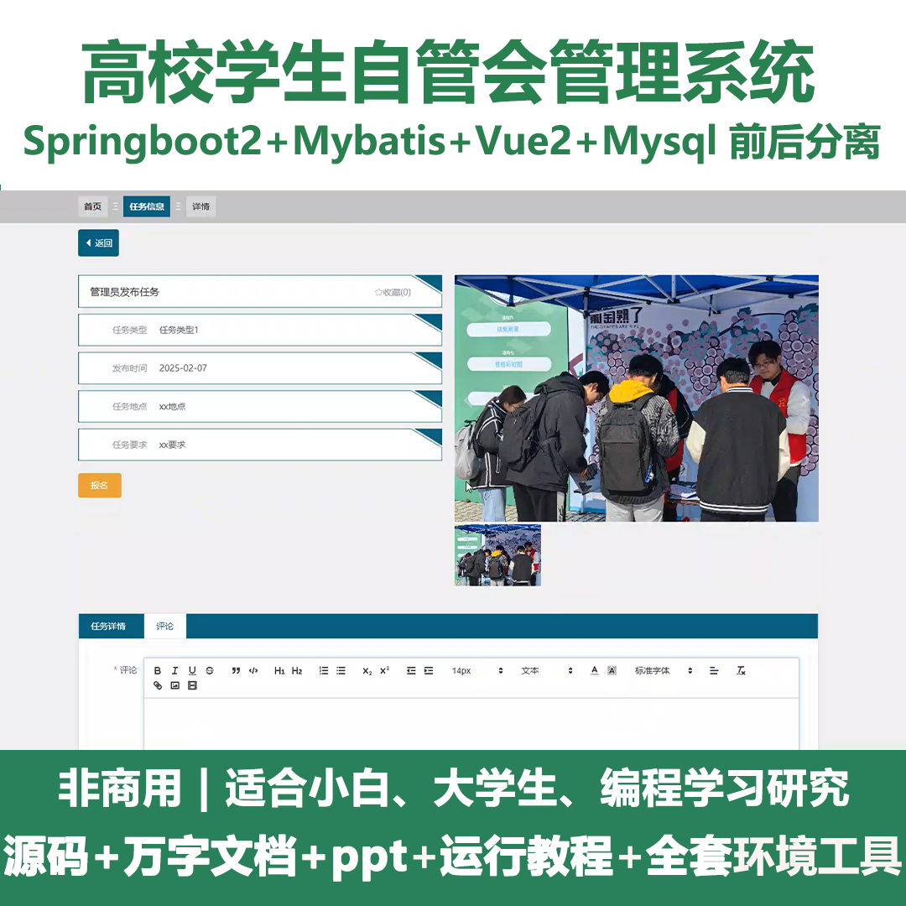
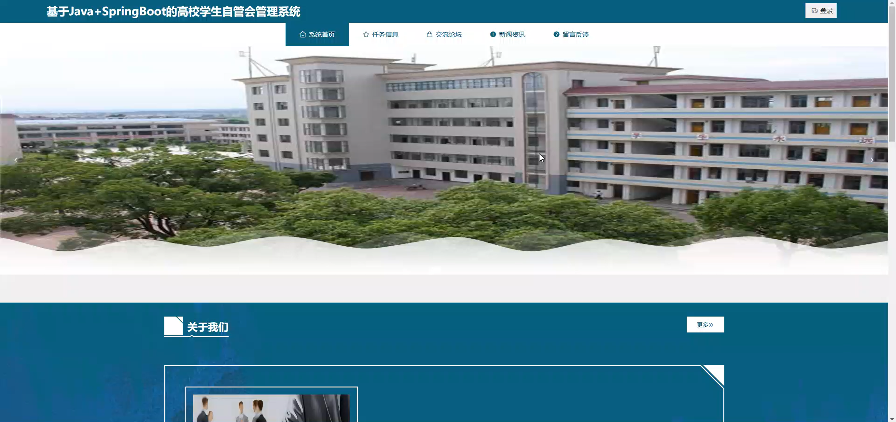
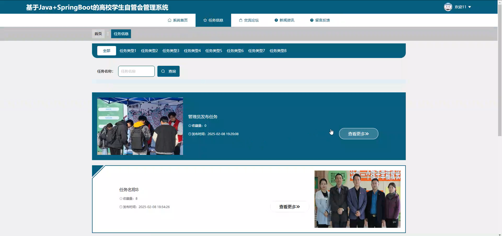
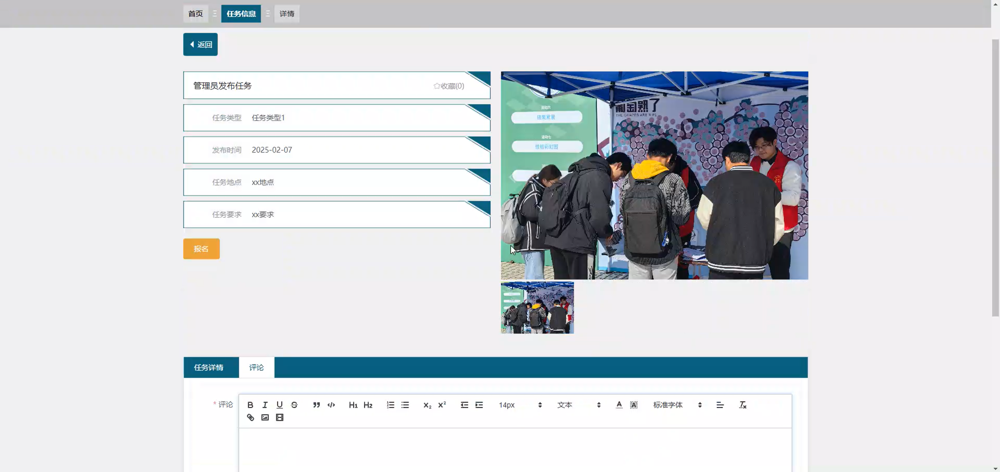
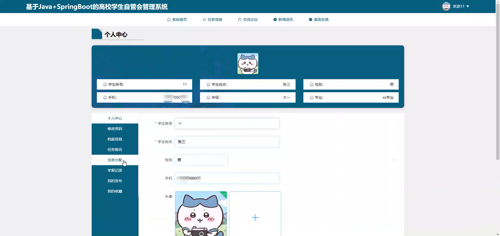
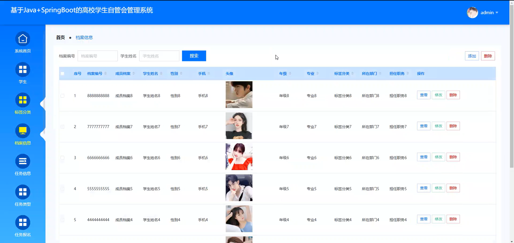
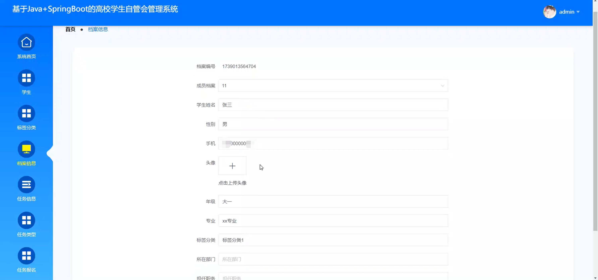
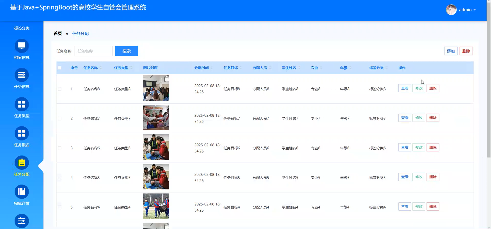
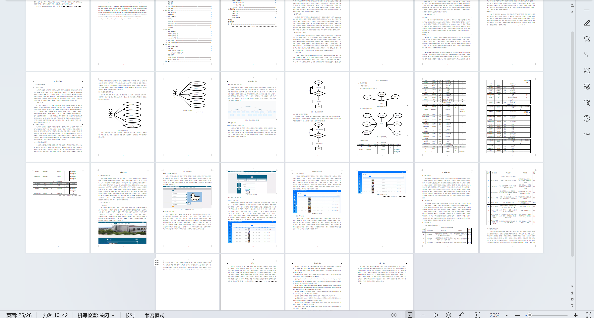

# pringbootA452D
pringbootA452D高校学生自管会管理系统+LW+PPT
 
## 查看主页获取源码

### 一、关键词
任务报名、任务分配、任务信息

### 二、作品包含
源码+数据库+设计文档万字+ppt+全套环境和工具资源+本地部署教程

### 三、项目技术
前端技术：Html、Css、Js、Vue2.0、Element-ui 
后端技术：Java、SpringBoot2.0、MyBatis

### 四、运行环境（以下版本亲测，其他版本未知，请自测）
开发工具：IDEA/eclipse  + VSCODE

数据库：MySQL5.7（最低要5.7版本）

数据库管理工具：Navicat10以上版本

环境配置软件： JDK1.8 + Maven3.6.3

前端Nodejs：14

浏览器：谷歌浏览器

### 五、项目介绍
项目编号：springbootA452D

高校学生自管会管理系统，助力提升自管会工作效率与管理规范性，更好服务学生群体与校园建设。

角色：管理员、用户

用户功能：系统首页、任务信息、交流论坛、新闻资讯、留言反馈、个人中心、修改密码、档案信息、任务报名、任务分配、举报记录、我的发布、我的收藏。

管理员功能：系统首页、学生、标签分类、档案信息、任务信息、任务类型、任务报名、任务分配、完成详情、留言反馈、交流论坛、论坛分类、举报记录、系统管理。

### 六、运行截图

